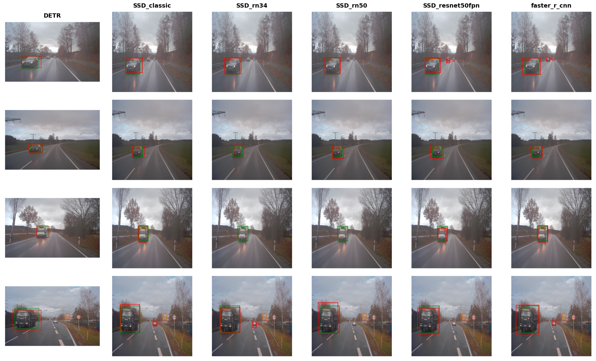

# 2d-object-detection


## 1. Введение

Детекция объектов — это ключевая задача компьютерного зрения, которая заключается в определении местоположения и класса объектов на изображении или в видеопотоке. Результат работы детектора — набор **ограничивающих рамок** (bounding boxes), которые обводят объекты, вместе с метками классов и оценками достоверности для каждой рамки. Этот подход идеален, когда нужно найти и распознать объекты в сцене, но не требуется точная информация о их форме или границах на уровне пикселей.

В стандартных подходах к детекции объектов используются два основных формата задания координат рамок: **SSD** (абсолютные пиксельные координаты) и **YOLO** (относительные нормализованные координаты). Система координат определяется так:

- **Начало координат**: Левый верхний угол изображения (точка (0, 0)).
- **Ось X**: Направлена вправо, от левого края (X=0) до правого (X=ширина изображения).
- **Ось Y**: Направлена вниз, от верхнего края (Y=0) до нижнего (Y=высота изображения).

Эти правила применяются к обоим форматам — SSD и YOLO.

### Формат SSD
- **Формат рамок**: `[xmin, ymin, xmax, ymax]` или `[left, top, right, bottom]` в абсолютных пиксельных координатах.
- **xmin/left**: X-координата левого верхнего угла (от 0 до ширины изображения).
- **ymin/top**: Y-координата левого верхнего угла (от 0 до высоты изображения).
- **xmax/right**: X-координата правого нижнего угла (xmin < xmax).
- **ymax/bottom**: Y-координата правого нижнего угла (ymin < ymax).

### Формат YOLO
- **Формат рамок**: `[class_id, x_center, y_center, width, height]` в относительных координатах, нормализованных от 0 до 1 относительно размеров изображения.
- **x_center**: X-координата центра рамки (xmin + width/2), делённая на ширину изображения.
- **y_center**: Y-координата центра рамки (ymin + height/2), делённая на высоту изображения.
- **width**: Ширина рамки, нормализованная по ширине изображения.
- **height**: Высота рамки, нормализованная по высоте изображения.

## 2. Датасет

Модели, рассмотренные в этом проекте, обучались и тестировались на датасете **Audi Autonomous Driving Dataset (A2D2)**, выпущенном Audi в 2020 году. A2D2 — открытый датасет, созданный для исследований в области автономного вождения, компьютерного зрения и робототехники. Он содержит данные с нескольких сенсоров:

- **Камеры**: Шесть RGB-камер высокого разрешения (1920x1208) с покрытием 360 градусов.
- **LiDAR**: 3D-облака точек для точного описания пространства.
- **Аннотации**: 2D- и 3D-ограничивающие рамки для объектов и маски для семантической сегментации.

Официальный сайт: [www.a2d2.audi](http://www.a2d2.audi).

В A2D2 ограничивающие рамки представлены в системе координат **Bird's-Eye View (BEV)** (вид сверху), что упрощает обработку данных с камер и LiDAR в 3D-пространстве. Система координат BEV:

- **Ось X**: Направлена вперёд вдоль продольной оси автомобиля (от задней части к передней).
- **Ось Y**: Направлена влево, перпендикулярно движению автомобиля.
- **Ось Z**: Направлена вверх, перпендикулярно поверхности земли (в 2D BEV проекции Z часто игнорируется).

Система координат камеры:

- **Ось X**: Направлена вправо, перпендикулярно движению автомобиля.
- **Ось Y**: Направлена вниз, перпендикулярно поверхности земли.
- **Ось Z**: Направлена вперёд вдоль продольной оси автомобиля.

Для выполнения 2D- или монокулярной 3D-детекции рамки из BEV (LiDAR) преобразовывались в координаты камеры с помощью функций `read_bounding_boxes_2d` и `read_bounding_boxes_3d`. В проекте использовались данные только с фронтальной камеры (`cam_front_center`).

### Структура датасета
Датасет организован следующим образом:

```
Dataset a2d2 = camera_lidar_semantic_bboxes/
├── camera/
│   ├── special/
│   │   ├── scene_num/
│   │   │   ├── camera/
│   │   │   │   ├── cam_front_center/
│   │   │   │   │   ├── scene_num_camera_frontcenter_identify.json
│   │   │   │   │   ├── scene_num_camera_frontcenter_identify.png
│   │   │   ├── label/
│   │   │   │   ├── cam_front_center/
│   │   │   │   │   ├── scene_num_label_frontcenter_identify.png
│   │   │   ├── label3d/
│   │   │   │   ├── cam_front_center/
│   │   │   │   │   ├── scene_num_label3D_frontcenter_identify.json
│   ├── train/
│   │   ├── scene_num/
│   │   │   ├── camera/
│   │   │   │   ├── cam_front_center/
│   │   │   │   │   ├── scene_num_camera_frontcenter_identify.json
│   │   │   │   │   ├── scene_num_camera_frontcenter_identify.png
│   │   │   ├── label/
│   │   │   │   ├── cam_front_center/
│   │   │   │   │   ├── scene_num_label_frontcenter_identify.png
│   │   │   ├── label3d/
│   │   │   │   ├── cam_front_center/
│   │   │   │   │   ├── scene_num_label3D_frontcenter_identify.json
│   ├── test/
│   │   ├── scene_num/
│   │   │   ├── camera/
│   │   │   │   ├── cam_front_center/
│   │   │   │   │   ├── scene_num_camera_frontcenter_identify.json
│   │   │   │   │   ├── scene_num_camera_frontcenter_identify.png
│   │   │   ├── label/
│   │   │   │   ├── cam_front_center/
│   │   │   │   │   ├── scene_num_label_frontcenter_identify.png
│   │   │   ├── label3d/
│   │   │   │   ├── cam_front_center/
│   │   │   │   │   ├── scene_num_label3D_frontcenter_identify.json
│   ├── LICENSE
│   ├── class_list.json
```

## 3. Модели

В проекте исследованы несколько моделей детекции объектов: **Faster R-CNN**, **SSD** (с разными бэкбонами) и **DETR**. Каждая модель имеет свои сильные стороны, что делает их подходящими для различных сценариев.

## 4. Faster R-CNN

Faster R-CNN — это двухэтапный детектор объектов, который сочетает генерацию предложений регионов с классификацией и локализацией объектов. Представленная в 2015 году, модель улучшает R-CNN и Fast R-CNN за счёт интеграции Region Proposal Network (RPN), обеспечивая высокую точность и приемлемую скорость.


### Ключевые компоненты
#### Бэкбон
Бэкбон — это свёрточная нейронная сеть (CNN), обычно предобученная на ImageNet (например, VGG-16 или ResNet), которая извлекает карты признаков из входного изображения. Эти карты содержат визуальные паттерны, такие как края, текстуры и формы, используемые для генерации регионов и детекции.

#### Region Proposal Network (RPN)
RPN сканирует карту признаков с помощью небольшого скользящего окна (например, 3x3) и предлагает регионы, где могут быть объекты. Для каждой позиции окна создаются **якоря** — заранее заданные прямоугольники разных размеров и пропорций. Для каждого якоря RPN предсказывает:
- **Вероятность объекта**: Содержит ли якорь объект или это фон (бинарная классификация).
- **Корректировка рамки**: Сдвиги (x, y, ширина, высота) для улучшения положения и размера якоря.

#### RoI Pooling (Region of Interest Pooling)
RoI Pooling преобразует предложенные регионы в куски карты признаков фиксированного размера (например, 7x7). Это позволяет обрабатывать регионы разных размеров единообразно, как вырезание кусочков пазла одинакового размера.

#### Головы классификации и регрессии
После RoI Pooling две головы обрабатывают каждый регион:
- **Голова классификации**: Присваивает вероятности классов (например, «машина», «человек» или «фон») с помощью softmax для \( K+1 \) классов (K объектов + фон).
- **Голова регрессии**: Уточняет координаты рамки, чтобы она лучше охватывала объект.

Faster R-CNN — **двухэтапный детектор**:
1. RPN генерирует предложения регионов из карты признаков.
2. Головы классификации и регрессии определяют классы и уточняют рамки.

## 5. SSD (Single Shot MultiBox Detector)

SSD — это одностадийный детектор, который предсказывает объекты в один проход, что делает его быстрым и подходящим для приложений реального времени. Представленный в 2016 году, SSD сочетает скорость и точность благодаря использованию карт признаков разного масштаба.


### Ключевые компоненты
#### Бэкбон
Как и в Faster R-CNN, SSD использует предобученную CNN (например, VGG-16 или ResNet) для создания карт признаков, которые содержат информацию от мелких деталей до высокоуровневой семантики.

#### Feature Pyramid Network (FPN)
FPN улучшает SSD, создавая пирамиду карт признаков с разным разрешением, объединяя детали низкоуровневых слоёв и контекст высокоуровневых:
- **Bottom-up путь**: Бэкбон создаёт карты признаков уменьшающегося размера (например, 38x38x512, 19x19x1024).
- **Top-down путь**: FPN увеличивает (upsampling) высокоуровневые карты (например, 3x3) и объединяет их с соответствующими bottom-up картами (например, 5x5) через поэлементное сложение после приведения к одинаковому числу каналов (1x1 свёртка).
- **Результат**: Карты признаков с одинаковым числом каналов (например, 256), содержащие и детали, и контекст, что улучшает детекцию мелких объектов.

#### Default Boxes (Опорные рамки)
Опорные рамки (default boxes) — это заранее заданные прямоугольники, используемые как шаблоны для поиска объектов. Они создаются на каждой карте признаков:
- **Генерация**: Для каждой позиции (xi, yi) на карте (например, 38x38) генерируется \( k \) рамок (обычно \( k=4 \) или 6) с масштабами и пропорциями, зависящими от карты. Масштабы варьируются от 0.1 до 0.9 (относительно размера изображения), пропорции включают {1, 2, 3, 1/2, 1/3}.
- **Центры**: Привязаны к позициям карты с учётом её шага (stride, например, 8 для карты 38x38 на изображении 300x300).
- **Общее число**: Для SSD300 — около 8732 рамок (38²×4 + 19²×6 + ...).

| Размер карты признаков | Масштаб | Пропорции | Рамок на ячейку | Всего рамок |
|------------------------|---------|-------------------|-----------------|-------------|
| 38x38                  | 0.1     | 1:1, 1:2, 2:1    | 4               | 5776        |
| 19x19                  | 0.2     | 1:1, 2:1, 1:2, 3:1, 1:3 | 6      | 2166        |
| 10x10                  | 0.375   | 1:1, 2:1, 1:2, 3:1, 1:3 | 6      | 600         |
| 5x5                    | 0.55    | 1:1, 2:1, 1:2, 3:1, 1:3 | 6      | 150         |
| 3x3                    | 0.725   | 1:1, 1:2, 2:1    | 4               | 36          |
| 1x1                    | 0.9     | 1:1, 1:2, 2:1    | 4               | 4           |
| **Всего**              |         |                   |                 | **8732**    |

#### Головы предсказаний
Головы — это свёрточные слои, которые обрабатывают карты признаков для предсказания:
- **Регрессионная голова**: Выдаёт \( 4 \times k \) каналов на позицию карты, представляя сдвиги (x, y, ширина, высота) для каждой опорной рамки.
- **Классификационная голова**: Выдаёт \( (C+1) \times k \) каналов, предсказывая вероятности классов (C классов + фон).
- **Выход**: Для каждой рамки SSD предсказывает класс и сдвиги, всего \( 8732 \times (4 + C + 1) \) предсказаний.

SSD — **одностадийный детектор**, так как предсказывает классы и рамки напрямую, без отдельного этапа генерации регионов, в отличие от Faster R-CNN.

## 6. DETR (DEtection TRansformer)

DETR — это модель на основе трансформеров, представленная в 2020 году. В отличие от Faster R-CNN и SSD, она не использует якоря или предложения регионов, рассматривая детекцию как задачу прямого предсказания набора объектов. Это делает DETR проще и универсальнее.


### Ключевые компоненты
#### Бэкбон
DETR использует предобученную CNN (например, ResNet-50 или ResNet-101) для извлечения карт признаков, которые затем сжимаются до фиксированного числа каналов (например, 256) с помощью 1x1 свёртки.

#### Трансформер
Трансформер обрабатывает карту признаков для предсказания объектов:
- **Подготовка входа**: Карта признаков (например, \( H' \times W' \times 256 \)) преобразуется в последовательность из \( H' \cdot W' \) токенов, каждый — вектор размером 256. Добавляются позиционные эмбеддинги, чтобы учесть пространственное положение.
- **Энкодер**: Состоит из \( N \) (обычно 6) слоёв с multi-head self-attention и feed-forward сетями (FFN). Улучшает карту признаков, позволяя токенам обмениваться глобальным контекстом.
- **Декодер**: Принимает \( N_q = 100 \) обучаемых запросов объектов (векторы размером 256). Использует self-attention (между запросами) и cross-attention (между запросами и токенами энкодера) для предсказания объектов.


#### Головы предсказаний
Каждый запрос объекта обрабатывается feed-forward сетью (FFN):
- **Классификационная голова**: Предсказывает вероятности классов для \( C+1 \) классов (C объектов + фон) с помощью softmax.
- **Регрессионная голова**: Предсказывает нормализованные координаты рамки \( [c_x, c_y, w, h] \) (формат YOLO) с помощью сигмоиды.

#### Бипартитное соответствие
DETR использует венгерский алгоритм для сопоставления предсказанных рамок (\( N_q \)) с ground-truth (\( M \), где \( M \leq N_q \)). Алгоритм минимизирует комбинированную потерю:
- Кросс-энтропия для классификации.
- L1 loss и Generalized IoU (GIoU) для координат рамок.

## 7. Метрики детекции

Метрики оценивают точность локализации объектов (bounding boxes) и их классификации.

### Intersection over Union (IoU)
IoU измеряет пересечение предсказанной и истинной рамки:
\[
\text{IoU} = \frac{\text{Площадь пересечения}}{\text{Площадь объединения}}
\]
- IoU от 0 (нет пересечения) до 1 (полное совпадение).
- Определяет истинно положительные предсказания (True Positive, TP, IoU ≥ порога, например, 0.5) и используется в NMS.

### Precision и Recall
- **Precision (Точность)**: Доля правильных предсказанных рамок среди всех предсказанных.
  \[
  \text{Precision} = \frac{\text{TP}}{\text{TP} + \text{FP}}
  \]
- **Recall (Полнота)**: Доля найденных объектов среди всех ground-truth объектов.
  \[
  \text{Recall} = \frac{\text{TP}}{\text{TP} + \text{FN}}
  \]
- Кривые Precision-Recall показывают баланс между этими метриками.

### Average Precision (AP)
AP — это площадь под кривой Precision-Recall для одного класса, усреднённая по всем уровням Recall.

### Mean Average Precision (mAP)
mAP — это средняя AP по всем классам:
\[
\text{mAP} = \frac{1}{C} \sum_{c=1}^C \text{AP}_c
\]
- Варианты: mAP@0.5 (IoU=0.5) или mAP@0.5:0.95 (усреднённая по IoU от 0.5 до 0.95).

## 8. Результаты

В рамках проекта были реализованы и протестированы шесть моделей детекции объектов на датасете A2D2 (фронтальная камера): **Faster R-CNN**, **SSD Classic**, **SSD с бэкбоном ResNet-34**, **SSD с бэкбоном ResNet-50**, **SSD с ResNet-50 и FPN**, и **DETR**. Оценка проводилась с использованием метрик **mAP@0.5:0.95** и **AP** для двух классов (обозначены как 3 и 4, вероятно, «машина» и «пешеход» или аналогичные категории). Ниже представлены количественные и качественные результаты.

### Количественные результаты
Таблица ниже суммирует значения **mAP** и **AP** для каждой модели на тестовом наборе A2D2:

| Модель                 | mAP@0.5:0.95 | AP (Класс 3) | AP (Класс 4) |
|------------------------|--------------|--------------|--------------|
| Faster R-CNN           | 0.906        | 0.941        | 0.870        |
| DETR                   | 0.735        | 0.735        | 0.734        |
| SSD Classic            | 0.867        | 0.914        | 0.820        |
| SSD ResNet-34          | 0.828        | 0.869        | 0.787        |
| SSD ResNet-50          | 0.856        | 0.885        | 0.828        |
| SSD ResNet-50 + FPN    | 0.852        | 0.863        | 0.841        |

**Наблюдения**:
- **Faster R-CNN** показала наивысший mAP (0.906), особенно для класса 3 (0.941). Двухэтапный подход обеспечивает точную локализацию и классификацию, что делает её лидером.
- **SSD Classic** превзошла другие варианты SSD с mAP 0.867, вероятно, благодаря оптимизированному бэкбону VGG-16 для A2D2.
- **SSD с ResNet-34** имеет самый низкий mAP (0.828) среди SSD, что указывает на меньшую эффективность ResNet-34 по сравнению с VGG-16 или ResNet-50 для этого датасета.
- **SSD с ResNet-50** и **SSD с ResNet-50 + FPN** показали схожие результаты (mAP 0.856 и 0.852), но FPN улучшила детекцию класса 4 (0.841 против 0.828), вероятно, за счёт лучшей обработки мелких объектов.
- **DETR** имеет самый низкий mAP (0.735), что отражает её сложности с мелкими объектами и необходимость длительного обучения, хотя подход без якорей упрощает архитектуру.

### Качественные результаты
На изображении ниже показаны примеры предсказаний всех моделей на одном кадре из датасета A2D2:



Эта визуализация демонстрирует различия в точности рамок и классификации. Faster R-CNN и SSD Classic обычно дают более точные рамки, тогда как DETR может испытывать трудности с мелкими или плотно расположенными объектами.

### Кривые Precision-Recall
Кривые Precision-Recall для каждой модели приведены ниже, показывая баланс между точностью и полнотой для обоих классов:


- **Faster R-CNN** сохраняет высокую точность при широком диапазоне полноты, демонстрируя свою надёжность.
- **Варианты SSD** показывают хорошие результаты, но их точность снижается на высоких уровнях полноты по сравнению с Faster R-CNN.
- **DETR** имеет более плоскую кривую, что указывает на стабильную, но менее высокую производительность, особенно для класса 4.

### Анализ
- **Faster R-CNN** идеальна для задач, требующих высокой точности, например, в автономном вождении на A2D2, но она медленнее из-за двухэтапной природы.
- **Варианты SSD** обеспечивают баланс между скоростью и точностью, а FPN улучшает детекцию мелких объектов (например, пешеходов).
- **DETR** предлагает современный подход без якорей, но требует больше оптимизации для конкуренции с свёрточными моделями на A2D2.

Эти результаты помогают выбрать модель в зависимости от задачи: высокая точность для критических систем или скорость для приложений реального времени.
